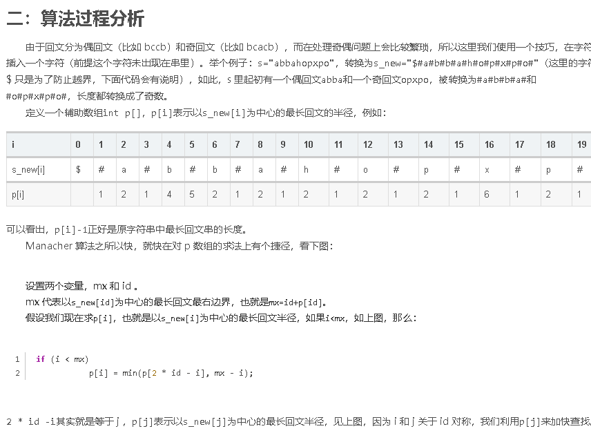

# 字符串

## 字符串Hash

双哈希，重载pair运算符，重载哈希以支持unordered_set

```c++
/*
scanf("%s", s);
Hash h;
h.init(s);
h.ask(1, n);
*/
pll operator % (const pll &p1, const pll &p2) {
    return {p1.first % p2.first, p1.second % p2.second};
}
pll operator * (const pll &p1, const pll &p2) {
    return {p1.first * p2.first, p1.second * p2.second};
}
pll operator + (const pll &p1, const pll &p2) {
    return {p1.first + p2.first, p1.second + p2.second};
}
pll operator - (const pll &p1, const pll &p2) {
    return {p1.first - p2.first, p1.second - p2.second};
}

struct Hash {
    string s;
    vector<pll> f;i
    int n;
  	// index from 1
    void init(char ss[]) {
        s = " ";
        s += string(ss);
        n = (int) s.length() - 1;
        f.resize(n + 1, {0, 0});
        for (int i = 1; i <= n; i++) {
            int ch = s[i] - 'a';
            f[i] = (f[i - 1] * base % mod + pll{ch, ch}) % mod;
        }
    }
  	// [l, r]
    pll ask(int l, int r) {
        return (f[r] - f[l - 1] * pw[r - l + 1] % mod + mod) % mod;
    }
};
```


## 最小表示法

从 $S$ 的所有循环同构表示中找到字典序最小的一个表示，代码用 `pair<ll, ll>` 作示例

```c++
void solve_ring(vector<pll> &h, vector<pll> &ret) {
    int n = h.size();
    int k = 0, x = 0, y = 1;
    while (k < n && x < n && y < n) {
        if (h[(x + k) % n] == h[(y + k) % n]) {
            k++;
        } else {
            if (h[(x + k) % n] > h[(y + k) % n]) {
                x = x + k + 1;
            } else {
                y = y + k + 1;
            }
            if (x == y) x++;
            k = 0;
        }
    }
    int src = min(x, y);
    for (int i = src; i < n; i++) ret.push_back(h[i]);
    for (int i = 0; i < src; i++) ret.push_back(h[i]);
}
```


## KMP单模板串匹配

```c++
//s为匹配串, t为模板串

int nxt[maxn];

void GetNext() {
    int j = 0, k = -1;
    nxt[0] = -1;

    while (j < m) {
        if (k == -1 || t[j] == t[k]) {
            j++, k++;
            nxt[j] = k;
        } else {
            k = nxt[k];
        }
    }
}

int kmp() {
    GetNext();

    int i = 0, j = 0;
    int ans = 0;
    while (i < n) {
        if (j == -1 || s[i] == t[j]) {
            i++, j++;
        } else {
            j = nxt[j];
        }

        if (j == m) {
            ans++;
            j = nxt[j];
        }
    }

    return ans;
}
```


## 拓展kmp

```c++
//exkmp求t与s的每一个后缀的LCP
#include <bits/stdc++.h>

typedef long long ll;
using namespace std;
const int maxn = 100005;

char s[maxn], t[maxn];  //t为模板串
int lenS, lenT;
int ex[maxn], nxt[maxn];

void getNext() {
    int i = 0;
    while (i + 1 < lenT && t[i] == t[i + 1]) i++;
    nxt[0] = lenT, nxt[1] = i;

    int p = 1, mx = 1 + i;
    for (i = 2; i < lenT; i++) {
        if (nxt[i - p] + i < mx) {
            nxt[i] = nxt[i - p];
        } else {
            int j = max(mx - i, 0);
            while (i + j < lenT && t[i + j] == t[j]) j++;
            nxt[i] = j;
            p = i, mx = i + j;
        }
    }
}

void exKMP() {
    getNext();

    int i = 0, p = 0, mx;
    while (s[i] == t[i] && i < lenS && i < lenT) i++;
    ex[0] = i, mx = i;

    for (i = 1; i < lenS; i++) {
        if (nxt[i - p] + i < mx) {
            ex[i] = nxt[i - p];
        } else {
            int j = max(mx - i, 0);
            while (i + j < lenS && j < lenT && s[i + j] == t[j]) j++;
            ex[i] = j;
            p = i, mx = i + j;
        }
    }
}

int main() {

    while (~scanf("%s%s", s, t)) {
        lenS = strlen(s), lenT = strlen(t);
        exKMP();
        
    }

    return 0;
}
```


## AC自动机

```c++
//AC自动机
#include <bits/stdc++.h>

using namespace std;
typedef long long ll;
const int maxn = 200005;
const int maxm = 2000005;
const int inf = 0x3f3f3f3f;

int n, tot;
char s[maxm];

struct AC_auto {
    int fail;
    int nxt[26];
    int end;
    int last;   //上一个结束节点
} ac[maxn];

inline void newNode() {
    tot++;
    memset(ac[tot].nxt, 0, sizeof(ac[tot].nxt));
    ac[tot].end = ac[tot].fail = 0;
    ac[tot].last = 0;
}

void init() {
    tot = 0; newNode();
}

void Build() {
    int len = strlen(s);
    int now = 1;
    for (int i = 0; i < len; i++) {
        int ch = s[i] - 'a';
        if (ac[now].nxt[ch] == 0) {
            newNode();
            ac[now].nxt[ch] = tot;
        }
        now = ac[now].nxt[ch];
    }
    ac[now].end++;
}

void GetFail() {
    for (int i = 0; i < 26; i++) ac[0].nxt[i] = 1;
    ac[1].fail = 0;

    queue<int> q;
    q.push(1);
    while (!q.empty()) {
        int u = q.front(); q.pop();

        for (int i = 0; i < 26; i++) {
            int v = ac[u].nxt[i];
            int failTo = ac[u].fail;
            if (!v) {
                ac[u].nxt[i] = ac[failTo].nxt[i];
                continue;
            }

            while (failTo && !ac[failTo].nxt[i]) failTo = ac[failTo].fail;

            failTo = ac[failTo].nxt[i];
            ac[v].fail = failTo;
            ac[v].last = ac[failTo].end ? failTo : ac[failTo].last;

            q.push(v);
        }
    }
}

//匹配成功时操作函数Count()
inline void Count(int now) {
    while (now) {
        //计数、打印，视题目要求改动此处

        now = ac[now].last;
    }
}

void Query() {
    int len = strlen(s), now = 1;
    for (int i = 0; i < len; i++) {
        int ch = s[i] - 'a';
        now = ac[now].nxt[ch];

        if (ac[now].end) Count(now);
        else if (ac[now].last) Count(ac[now].last);
    }
}

void solve() {
    //计数、打印，视题目要求改动此处

}

int main() {
#ifndef ONLINE_JUDGE
    freopen("in.txt", "r", stdin);
    //freopen("out.txt", "w", stdout);
#endif

    while (~scanf("%d", &n)) {
        if (n == 0) break;
        init();

        for (int i = 0; i < n; i++) {
            scanf("%s", s);
            Build();
        }
        GetFail();

        scanf("%s", s);
        Query();

        solve();
    }

    return 0;
}
```


## Trie图

```c++
//trie图记每个模板串出现次数
#include <bits/stdc++.h>

using namespace std;
typedef long long ll;
const int maxn = 200005;
const int maxm = 2000005;
const int inf = 0x3f3f3f3f;

int n, tot;
char s[maxm];

struct AC_auto {
    int fail;
    int nxt[26];
    int end;
    int last;   //上一个结束节点

    vector<int> mp;
    vector<int> id;
    int cnt;
} ac[maxn];

int ans[maxn];

inline void newNode() {
    tot++;
    memset(ac[tot].nxt, 0, sizeof(ac[tot].nxt));
    ac[tot].end = ac[tot].fail = 0;
    ac[tot].last = 0;
    ac[tot].id.clear();
    ac[tot].mp.clear();
    ac[tot].cnt = 0;
}

void init() {
    tot = 0; newNode();
    for (int i = 0; i < n; i++) ans[i] = 0;
}

void Build(int id) {
    int len = strlen(s);
    int now = 1;
    for (int i = 0; i < len; i++) {
        int ch = s[i] - 'a';
        if (ac[now].nxt[ch] == 0) {
            newNode();
            ac[now].nxt[ch] = tot;
        }
        now = ac[now].nxt[ch];
    }
    ac[now].end = 1;
    ac[now].id.push_back(id);
}

void GetFail() {
    for (int i = 0; i < 26; i++) ac[0].nxt[i] = 1;
    ac[1].fail = 0;

    queue<int> q;
    q.push(1);
    while (!q.empty()) {
        int u = q.front(); q.pop();

        for (int i = 0; i < 26; i++) {
            int v = ac[u].nxt[i];
            int failTo = ac[u].fail;
            if (!v) {
                ac[u].nxt[i] = ac[failTo].nxt[i];
                continue;
            }

            while (failTo && !ac[failTo].nxt[i]) failTo = ac[failTo].fail;

            failTo = ac[failTo].nxt[i];
            ac[v].fail = failTo;
            ac[v].last = ac[failTo].end ? failTo : ac[failTo].last;

            if (ac[v].end) ac[ac[v].last].mp.push_back(v);

            q.push(v);
        }
    }
}

inline void Count(int now) {
    ac[now].cnt++;
}

void Query() {
    int len = strlen(s), now = 1;
    for (int i = 0; i < len; i++) {
        int ch = s[i] - 'a';
        now = ac[now].nxt[ch];

        if (ac[now].end) Count(now);
        else if (ac[now].last) Count(ac[now].last);
    }
}

int dfs(int u) {
    int size = ac[u].mp.size();
    int sum = 0;
    for (int i = 0; i < size; i++) {
        int v = ac[u].mp[i];
        sum += dfs(v);
    }

    size = ac[u].id.size();
    for (int i = 0; i < size; i++) {
        int id = ac[u].id[i];
        ans[id] = sum + ac[u].cnt;
    }

    return sum + ac[u].cnt;
}

void solve() {
    //计数、打印，视题目要求改动此处
    for (int i = 0; i < n; i++) printf("%d\n", ans[i]);
}

int main() {
#ifndef ONLINE_JUDGE
    freopen("in.txt", "r", stdin);
    //freopen("out.txt", "w", stdout);
#endif

    while (scanf("%d", &n) != EOF) {
        if (n == 0) break;
        init();

        for (int i = 0; i < n; i++) {
            scanf("%s", s);
            Build(i);
        }
        GetFail();

        scanf("%s", s);
        Query();
        dfs(0);

        solve();
    }

    return 0;
}
```


## Manacher



```c++
#include <bits/stdc++.h>

typedef long long ll;
using namespace std;
const int maxn = 100005;
const int inf = 0x3f3f3f3f;

char s[maxn];
char ss[maxn * 2];
int p[maxn * 2];

int init() {
    int len = strlen(s);
    ss[0] = '$', ss[1] = '#';
    int j = 2;
    for (int i = 0; i < len; i++) {
        ss[j++] = s[i];
        ss[j++] = '#';
    }
    ss[j] = '\0';

    return j;
}

void manacher() {
    int len = init();

    int id;
    int mx = 0;
    for (int i = 1; i < len; i++) {
        if (i < mx) {
            p[i] = min(p[2 * id - i], mx - i);
        } else {
            p[i] = 1;
        }

        while (ss[i - p[i]] == ss[i + p[i]]) {
            p[i]++;
        }

        if (i + p[i] > mx) {
            id = i;
            mx = i + p[i];
        }
    }

    for (int i = 1; i < len; i++) {
        p[i]--;
    }
}

int main() {

    scanf("%s", s);
    manacher();

    return 0;
}
```


## 回文自动机

```c++
//回文自动机求所有本质不同的回文串
#include <bits/stdc++.h>

using namespace std;
typedef long long ll;
const int maxn = 300005;

struct PamNode {
    int len, cnt, fail;
    int son[26];
}pam[maxn];

char s[maxn];
int last, tot;

inline void newNode(int len) {
    pam[tot].len = len, pam[tot].cnt = 0;
    for (int i = 0; i < 26; i++) pam[tot].son[i] = 0;

    tot++;
}

void init() {
    last = 0, tot = 0;
    newNode(0), newNode(-1);
    pam[0].fail = 1;
}

inline int GetFail(int now, int i) {
    while (s[i - pam[now].len - 1] != s[i]) now = pam[now].fail;
    return now;
}

void PAM() {
    init();

    int len = strlen(s + 1);
    for (int i = 1; i <= len; i++) {
        int ch = s[i] - 'a';
        last = GetFail(last, i);
        if (!pam[last].son[ch]) {
            newNode(pam[last].len + 2);
            int x = GetFail(pam[last].fail, i);
            pam[tot - 1].fail = pam[x].son[ch];

            pam[last].son[ch] = tot - 1;    //必须先求fail再连接节点
        }
        last = pam[last].son[ch];

        pam[last].cnt++;
    }
    for (int i = tot - 1; i >= 0; i--) pam[pam[i].fail].cnt += pam[i].cnt;
}

int main() {

    while (scanf("%s", s + 1) != EOF) {
        PAM();
    }
    return 0;
}
```


## 后缀数组

#### 求本质不同的子串的数量

第$i$个后缀对答案的贡献为$len - sa_i + 1 - height_i$

$ans=len*(len+1)/2-\sum_{i=2}^{n}height_i$

#### 求长度在[0, p]区间的本质不同的子串的数量

第$i$个后缀对答案的贡献为$max(0,min(p, len - sa_i + 1) - height_i)$

#### 求一个串中最长的不可重叠的重复子串

求一个串中最长的不可重叠的重复子串，二分答案长度k，对所有后缀分组，每组的 LCP >= k，检查每组是否有不重叠串

```c++
#include <bits/stdc++.h>

typedef long long ll;
using namespace std;
const int maxn = 1000005;
const int mod = 1e9 + 7;

char s[maxn];
int len, sz, rak[maxn], last[maxn], sa[maxn], tax[maxn], tp[maxn];

int height[maxn], H[maxn]; //height[i] = lcp(sa[i], sa[i - 1]), H[i] = height[rak[i]].

void Qsort() {
    for (int i = 0; i <= sz; i++) tax[i] = 0;
    for (int i = 1; i <= len; i++) tax[rak[i]]++;
    for (int i = 1; i <= sz; i++) tax[i] += tax[i - 1];
    for (int i = len; i >= 1; i--) sa[tax[rak[tp[i]]]--] = tp[i];
}

void SuffixSort() {
    sz = 1005;    //根据桶的大小修改初值
    for (int i = 1; i <= len; i++) rak[i] = s[i], tp[i] = i;
    Qsort();

    for (int step = 1, p = 0; p < len; sz = p, step <<= 1) {
        p = 0;
        for (int i = 1; i <= step; i++) tp[++p] = len - step + i;
        for (int i = 1; i <= len; i++) if (sa[i] > step) tp[++p] = sa[i] - step;
        Qsort();

        swap(rak, last);
        rak[sa[1]] = p = 1;
        for (int i = 2; i <= len; i++) {
            if (last[sa[i - 1]] == last[sa[i]] && last[sa[i - 1] + step] == last[sa[i] + step]) {
                rak[sa[i]] = p;
            } else {
                rak[sa[i]] = ++p;
            }
        }
    }
}

void GetHeight() {
    int k = 0;
    for (int i = 1; i <= len; i++) {
        if (k) k--;
        int j = sa[rak[i] - 1];
        while (s[i + k] == s[j + k]) k++;
        H[i] = height[rak[i]] = k;
    }
}

int main() {

    while (~scanf("%s", s + 1)) {
        len = strlen(s + 1);
        SuffixSort();
        GetHeight();

    }

    return 0;
}
```